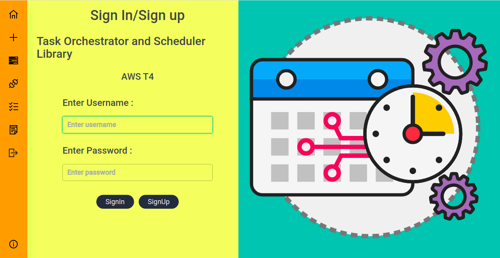
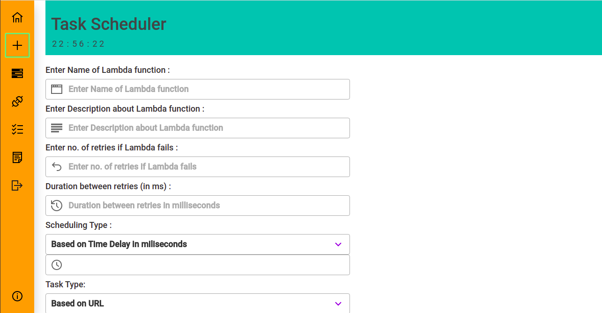
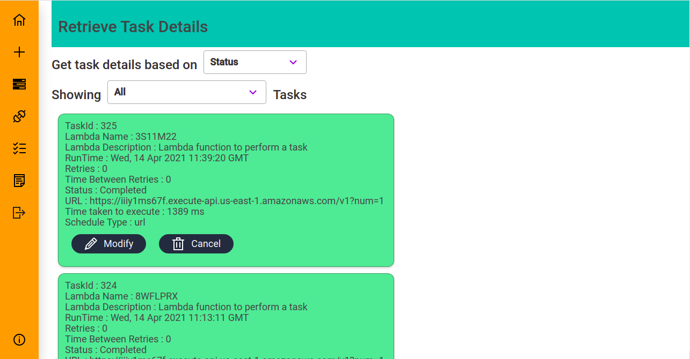
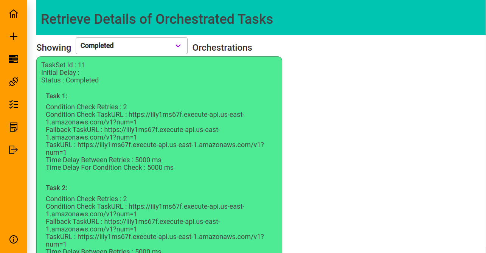
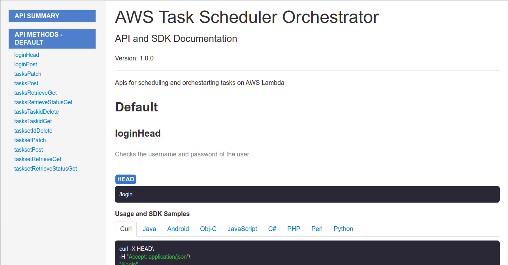
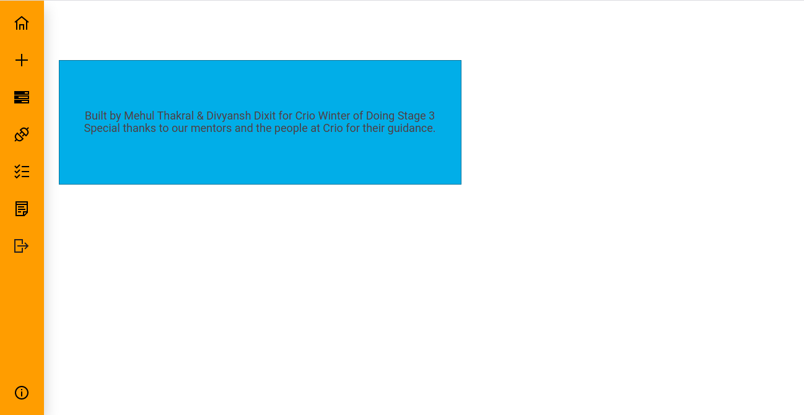

# AWS Task Scheduler and Orchestrator

<h4> Demo Video <a href="https://drive.google.com/drive/folders/1GhOObPULaDgg2N-oRXnj3ccb06TFEgQZ?usp=sharing">Link</a></h4>

<h4> Web App <a href="https://aws-t4-frontend.vercel.app/">Link</a></h4>

<h2> Requirements: </h2>
<ol>
  <li>NodeJs</li>
  <li>NPM</li>
  <li>PostgreSQL</li>
  <li>Python</li>
  <li>Pip</li>
  <li>Serverless</li>
</ol>

<h2> Steps to run locally: </h2>
<ol>
  <li>Python packages - <code> pip install requirements.txt </code></li>
  <li>Setup PostgreSQL and update credentials in main.py</li>
  <li>To run Backend - <code> cd backend && python main.py</code></li>
  <li>To run Frontend - <code> cd frontend && npm install && npm start</code></li>
  <li>Can got <a href="http://localhost:3000">http://localhost:3000</a> to start using the app</li>
</ol>

<h2> Screenshots: </h2>
<ol>
  <li>Login Page: </li>
  <li>Adding Single Task: </li>
  <li>Retrieving Tasks: </li>
  <li>Adding Orchestration: </li>
  <li>Retrieving Orchestrations: </li>
  <li>Swagger API Documentation: </li>
  <li>About Us: </li>
</ol>
